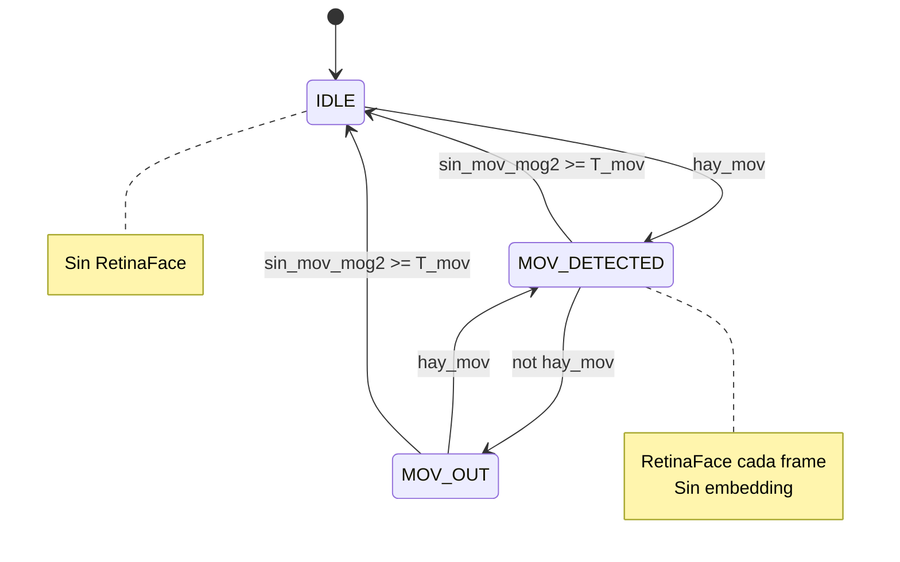
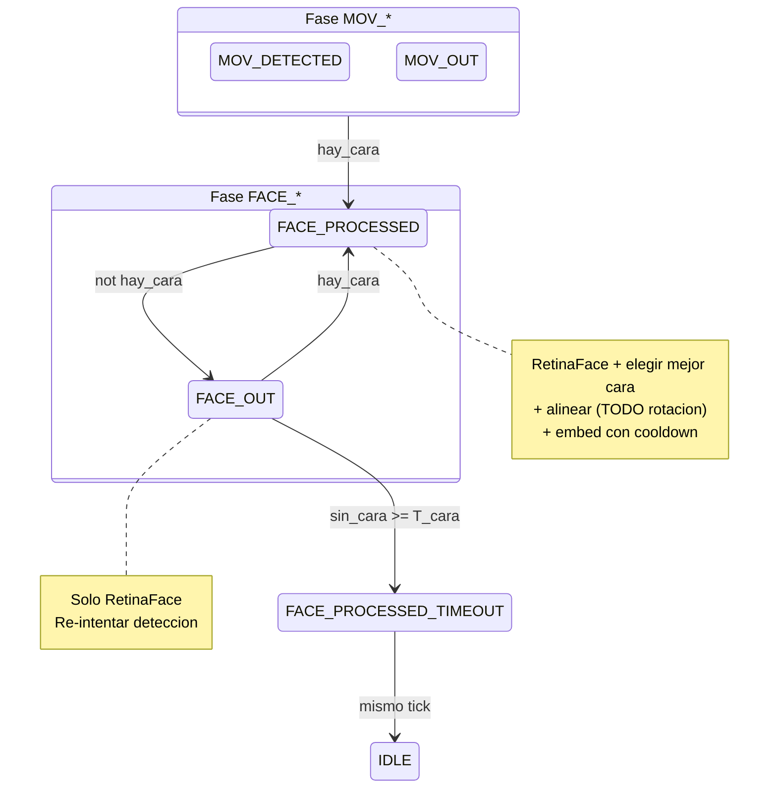
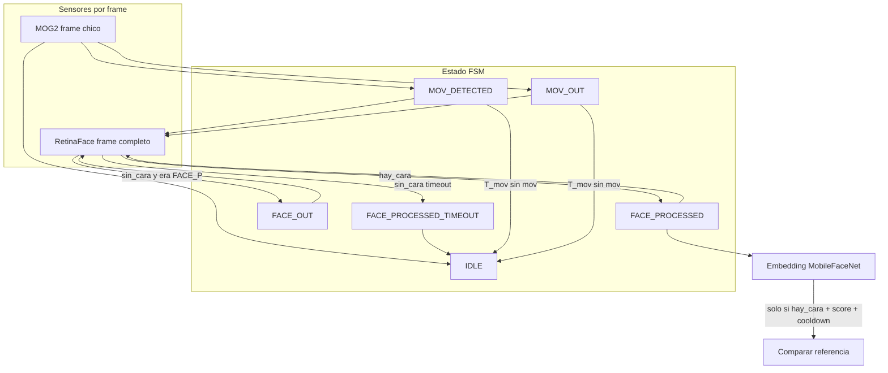

# Deteccion de movimiento + FSM + pipeline facial

Documento de diseno para el modulo **mov_detect**: capa ligera MOG2 que decide cuando activar RetinaFace, maquina de estados (FSM) que gobierna las fases del pipeline, y reglas acordadas para embedding dentro de `FACE_PROCESSED`.

**Referencias en el repo:**

| Archivo | Rol |
|---------|-----|
| `export_models/deteccion_movimiento.py` | Prototipo MOG2 solo (sin FSM ni modelo) |
| `export_models/deteccion_movimiento_fsm.py` | Referencia implementada: MOG2 + FSM + RetinaFace ONNX |
| `WIP/main_mov.py` | Punto de entrada objetivo (captura + FSM + modelos) |
| `WIP/main.py` | Pipeline de captura sin inferencia |
| `utils/capture_cameras.py` | Captura RTSP / SNAP / USB con hilo y MAX_FPS |
| `utils/aux_tools_retinaface.py` | Postproceso RetinaFace (comun ONNX y RKNN) |
| `utils/image_utils.py` | `letterbox_bgr` para entrada 320x320 |
| `export_models/RetinaFace_from_cam_with_id.py` | Referencia embed: crop, 112x112, MobileFaceNet, coseno |
| `export_models/cara_detectada_pipeline.md` | Ideas de calidad / estabilidad (M1–M13) |

---

## 1. Objetivo

En dispositivos edge (p. ej. RK3568) no conviene ejecutar RetinaFace en cada frame. El flujo acordado es:

1. **Sensor barato (MOG2)** sobre un frame reducido → detectar actividad en escena.
2. **FSM** → decidir fase (`IDLE`, busqueda de cara, seguimiento, salida).
3. **RetinaFace** solo en fases activas (no en `IDLE`).
4. **Embedding (MobileFaceNet)** solo en `FACE_PROCESSED` cuando hay detecciones validas.

La FSM separa dos preguntas distintas:

- **¿Hubo actividad en escena?** → estados `IDLE` / `MOV_*` (sensor MOG2).
- **¿Hay / se perdio la cara?** → estados `FACE_*` (sensor RetinaFace).

---

## 2. Capa MOG2 (sensor de movimiento)

### Que hace

- OpenCV `createBackgroundSubtractorMOG2` sobre frame **reducido** (p. ej. 320x240), no sobre la resolucion completa de captura.
- Por frame: `mask = fgbg.apply(small_frame)` → `pixel_count = countNonZero(mask)`.
- **Hay movimiento** si `pixel_count > movimiento_pixeles` (umbral configurable).

### Parametros tipicos (script de referencia)

| Parametro | Default | Notas |
|-----------|---------|-------|
| `ancho` x `alto` | 320 x 240 | Procesamiento MOG2; independiente de captura |
| `history` | 20 | Historial del modelo de fondo |
| `var_threshold` | 40 | Sensibilidad MOG2 |
| `warmup` | 20 frames | Calibracion inicial con `learningRate=0.5` |
| `fps` | 2.0 | Periodo del bucle (~0.5 s) |
| `movimiento_pixeles` | 1000 | Umbral sobre la mascara |

### Limitacion conocida

Si una persona permanece **mucho tiempo quieta**, MOG2 puede aprenderla como fondo y dejar de marcar movimiento. Por eso, una vez en fase `FACE_*`, **MOG2 ya no gobierna el estado** y la salida de sesion depende del timeout **sin cara** (RetinaFace), no del movimiento de fondo.

### Mejoras futuras (no implementadas)

- Morfologia open/close sobre la mascara (menos ruido / parpadeo `MOV_DETECTED` ↔ `MOV_OUT`).
- ROI central (ignorar bordes).
- Umbral relativo (`pixel_count / area`) ademas de piso absoluto.
- Congelar `learningRate=0` en fase `FACE_*` para no absorber a la persona al fondo (re-entradas a `MOV_*`).

---

## 3. Estados de la FSM

```text
IDLE                  Escena dormida. Sin inferencia RetinaFace.
MOV_DETECTED          MOG2 supero umbral en este frame.
MOV_OUT               MOG2 no supero umbral en este frame (fase de actividad / busqueda).
FACE_PROCESSED        Ultima inferencia RetinaFace encontro al menos una cara.
FACE_OUT              Ultima inferencia no encontro cara (tras haber estado en FACE_PROCESSED).
FACE_PROCESSED_TIMEOUT Paso transitorio (un tick) antes de volver a IDLE por timeout sin cara.
```

### Significado detallado

| Estado | MOG2 este frame | RetinaFace | Embed |
|--------|-----------------|------------|-------|
| `IDLE` | irrelevante | **No** | No |
| `MOV_DETECTED` | pico | **Si** | No |
| `MOV_OUT` | sin pico | **Si** | No |
| `FACE_PROCESSED` | no cambia estado | **Si** | **Si** (si hay cara y reglas OK) |
| `FACE_OUT` | no cambia estado | **Si** | No |
| `FACE_PROCESSED_TIMEOUT` | — | No | No |

### Por que `MOV_OUT` sigue infiriendo

`MOV_OUT` **no** significa “se fue la persona”. Significa: **en este frame MOG2 no hubo pico**, pero aun estamos en la ventana de busqueda (antes del timeout MOG2 o antes de enganchar cara).

Casos que justifican inferencia continua:

- Parpadeo MOG2 (`MOV_DETECTED` ↔ `MOV_OUT`).
- Movimiento breve y persona ya quieta, pero RetinaFace **aun no** detecto cara.

El escenario “persona quieta con cara presente” vive en **`FACE_PROCESSED`**, no en `MOV_OUT`. Ahi MOG2 puede estar en cero y la inferencia sigue.

### Por que `FACE_OUT` sigue infiriendo

Permite **re-adquirir** la cara tras falsos negativos temporales: giro de cabeza, oclusion, score bajo un frame, perfil extremo. Se infiere con normalidad hasta:

- Recuperar cara → `FACE_PROCESSED`, o
- Timeout sin cara → `IDLE`.

---

## 4. Diagrama de estados

### 4.1 Transiciones por MOG2



### 4.2 Transiciones por RetinaFace



### 4.3 Diagrama unificado (vista operativa)



---

## 5. Timeouts y relojes

### Variables temporales

| Variable | Se actualiza cuando |
|----------|---------------------|
| `t_ultimo_mov` | Frame con `hay_mov` MOG2 **o** frame con cara detectada |
| `t_ultima_cara` | Frame con cara detectada por RetinaFace |

### Reglas

1. **Timeout MOG2 (`T_mov`)**  
   Si `(now - t_ultimo_mov) >= T_mov` **y** estado en `MOV_DETECTED` o `MOV_OUT` → `IDLE`.  
   **No aplica** en `FACE_*`: persona quieta con cara no se expulsa por fondo MOG2 quieto.

2. **Timeout sin cara (`T_cara`)**  
   En `FACE_OUT`, si `(now - t_ultima_cara) >= T_cara` → `FACE_PROCESSED_TIMEOUT` → `IDLE` (mismo tick).

### Nota de diseno

En la referencia actual (`deteccion_movimiento_fsm.py`) un solo `--timeout_seg` cubre ambos casos. **Recomendacion para `main_mov.py`:** separar `T_mov` y `T_cara` en configuracion (p. ej. 5 s / 10–15 s).

---

## 6. Politica de inferencia RetinaFace

RetinaFace se ejecuta si el estado esta en:

```text
MOV_DETECTED | MOV_OUT | FACE_PROCESSED | FACE_OUT
```

y hay sesion de modelo cargada.

**No** se ejecuta en: `IDLE`, `FACE_PROCESSED_TIMEOUT`.

### Entrada al modelo

- Captura: cualquier resolucion (p. ej. 1280x720, 640x480).
- Preproceso: **letterbox** a 320x320 (sin recortar escena; bandas grises 114).
- Postproceso: `retinaface_dets_desde_rknn_outputs` con metadatos letterbox → cajas en **pixeles del frame original**.
- Backend PC: ONNX + onnxruntime. Backend placa: RKNN + rknnlite. **Mismo postproceso** en ambos.

Salida por deteccion: fila `(15,)` = `[x1, y1, x2, y2, score, 10 coords landmarks]`.

---

## 7. Embedding dentro de `FACE_PROCESSED` (sin estado `FACE_STABLE`)

### Decision de diseno

No se anade un estado enum `FACE_STABLE`. La calidad y el embed se resuelven **dentro de `FACE_PROCESSED`** con reglas internas.

### Flujo por tick (orden obligatorio)

```text
1. MOG2 + transiciones MOG2 + timeouts MOG2
2. Si toca RetinaFace: dets = inferencia
3. Actualizar estado segun hay_cara (logica actual)
4. Si state == FACE_PROCESSED and hay_cara:
       det = elegir_mejor_cara(dets)
       if score >= MIN_SCORE_EMBED:
           crop con margen
           # TODO: ajuste rotacion con landmarks (warp afine -> 112x112)
           por ahora: resize directo a 112x112
           if cooldown embed OK:
               embedding + comparar referencia
```

### Elegir la mejor cara: distancia entre ojos

Entre detecciones que pasen `score >= MIN_SCORE_EMBED`, elegir la de **mayor distancia interocular** en pixeles:

```text
dist_ojos = hypot(det[7] - det[5], det[8] - det[6])
```

Landmarks RetinaFace en la fila `det` (indices 5–14):

```text
[5,6] ojo izquierdo   [7,8] ojo derecho   [9,10] nariz   ...
```

**Motivo:** caras lejanas o falsos positivos pequenos tienen ojos muy juntos; la cara principal en primer plano suele tener mayor separacion ocular que el area de bbox sola.

Desempate opcional: mayor `score` RetinaFace.

Referencia previa en `RetinaFace_from_cam_with_id.py`: `argmax(dets[:, 4])` (solo score). El criterio acordado para mov_detect es **ojos + score minimo**.

### Alineacion / rotacion

```text
# TODO: ajuste rotacion — warp afine desde 5 landmarks a template ArcFace 112x112
```

Primera version: recorte con margen (`FACE_CROP_MARGIN_FRAC`) + resize a 112x112 + normalizacion ImageNet (como `RetinaFace_from_cam_with_id.py`). La rotacion se probara en una iteracion posterior.

### Cooldown de embedding

Aun sin `FACE_STABLE`, **no** embedear en cada frame de `FACE_PROCESSED`:

```text
if (now - t_ultimo_embed) >= EMBED_COOLDOWN_S:
    calcular y comparar
```

RetinaFace puede seguir a ~2 FPS; el embed es un evento espaciado (p. ej. cada 2–5 s, configurable).

### Parametros de referencia (cam_with_id)

| Parametro | Valor referencia | Uso |
|-----------|------------------|-----|
| `MIN_SCORE_MEJOR_CARA_EMBEDDING` | 0.90 | Umbral score para embed |
| `SIM_MIN_MATCH_VERIFICACION` | 0.45 | Coseno minimo vs referencia L2-normalizada |
| `FACE_CROP_MARGIN_FRAC` | 0.15 | Margen al recortar bbox |

---

## 8. Orden de evaluacion en cada iteracion del bucle

Resumen alineado con `deteccion_movimiento_fsm.py`:

```text
1. Capturar frame
2. MOG2 sobre frame reducido -> hay_mov, pixel_count
3. Actualizar t_ultimo_mov si hay_mov
4. Si timeout MOG2 y estado in (MOV_DETECTED, MOV_OUT) -> IDLE
5. Transiciones MOG2: IDLE <-> MOV_DETECTED <-> MOV_OUT
6. Si estado inferible: RetinaFace -> dets, hay_cara
7. Transiciones RetinaFace:
      hay_cara -> FACE_PROCESSED (+ t_ultima_cara, t_ultimo_mov)
      FACE_PROCESSED y not hay_cara -> FACE_OUT
      FACE_OUT y timeout cara -> FACE_PROCESSED_TIMEOUT
8. Si FACE_PROCESSED y hay_cara -> pipeline embed (seccion 7)
9. FACE_PROCESSED_TIMEOUT -> IDLE
10. Display / log / limitar FPS
```

---

## 9. Relacion ONNX / RKNN

| Capa | ONNX (PC) | RKNN (placa) |
|------|-----------|--------------|
| Letterbox + postproceso | `utils/` comun | `utils/` comun |
| Preproceso tensor | BGR float, mean en Python | RGB uint8, mean en modelo |
| Runtime | onnxruntime | rknnlite |
| FSM + MOG2 | CPU OpenCV | CPU OpenCV |

La FSM y las reglas de embed **no dependen** del backend de RetinaFace.

---

## 10. Integracion planificada en `WIP/main_mov.py`

Estado actual:

- **`mov_detect/`** implementado: `sensor_mog2.py`, `fsm.py`, `types.py`.
- **`main_mov.py`**: captura + warmup MOG2 antes del bucle + FSM (RetinaFace pendiente).
- Bucle explicito en `main` (sin clase Orchestrator).

### Arranque MOG2 (antes del bucle)

La captura corre a ~2 FPS en un hilo. Para calibrar fondo **sin esperar N frames del stream**:

```python
capture = CaptureCameras().start()
motion = Mog2MotionSensor(mog2_cfg)

motion.warmup_from_first_frame(
    capture.get_frame,
    n_frames=mog2_cfg.warmup_frames,  # default 20 applies del mismo frame
    timeout_s=s.MOG2_WARMUP_TIMEOUT_S,
)

while True:
    ok, frame = capture.get_frame()
    ...
```

**Comportamiento:** espera el **primer** frame valido, hace `.copy()`, aplica MOG2 `n_frames` veces con `learningRate` alto. Solo al inicio; despues el bucle usa frames nuevos del stream con ``evaluate()``.

### Estructura del paquete

```text
mov_detect/
  mov_detect.md
  __init__.py           # exports + config_from_settings()
  types.py              # FlowState, Mog2Config, FsmConfig, MotionResult, FsmTickResult
  sensor_mog2.py        # Mog2MotionSensor
  fsm.py                # MotionFaceFsm (tick_motion / tick_face)
```

### Bucle en main (sin Orchestrator)

```python
mov = motion.evaluate(frame)
fsm_out = fsm.tick_motion(hay_mov=mov.hay_mov, now=now)

if fsm_out.run_face_detector and face is not None:
    dets = face.detect(frame)
    fsm_out = fsm.tick_face(hay_cara=dets.has_faces, now=now)

if fsm_out.run_embedding and dets is not None:
    identity.process(frame, dets)
```

Pasos pendientes:

1. ~~Portar MOG2 + FSM~~ (hecho en `mov_detect/`).
2. Usar `CaptureCameras` + `configs/settings.py` (hecho en `main_mov.py`).
3. Anadir backend RetinaFace (`inference/`).
4. Bloque embed en `FACE_PROCESSED` segun seccion 7.
5. Arquitectura mas limpia (clase FSM ya separada; detector inyectado en main).

---

## 11. Visualizacion y depuracion (futuro)

Con display activo, overlay recomendado:

- Estado FSM actual.
- `pixel_count` MOG2 vs umbral.
- Mini-mascara MOG2.
- Bboxes y landmarks RetinaFace.
- Indicador embed: score, similitud, MATCH / NO_MATCH.

---

## 12. Glosario rapido

| Termino | Significado |
|---------|-------------|
| `hay_mov` | MOG2: pixel_count > umbral |
| `hay_cara` | RetinaFace: al menos una deteccion tras postproceso |
| `T_mov` | Segundos sin movimiento MOG2 para salir de fase `MOV_*` |
| `T_cara` | Segundos sin cara para salir de fase `FACE_*` |
| Letterbox | Escalar imagen entera a 320x320 sin recortar; bandas grises |
| Embed | Vector MobileFaceNet 112x112, L2-normalizado, comparacion coseno |

---

## 13. Historial de decisiones

| Fecha | Decision |
|-------|----------|
| 2026-06 | MOG2 como gate antes de RetinaFace en edge |
| 2026-06 | FSM explicita con separacion MOV_* / FACE_* |
| 2026-06 | Mantener inferencia en `MOV_OUT` y `FACE_OUT` (busqueda y re-adquisicion) |
| 2026-06 | No usar estado `FACE_STABLE`; embed solo en `FACE_PROCESSED` |
| 2026-06 | Mejor cara por distancia entre ojos + score minimo |
| 2026-06 | Rotacion / warp: TODO; primera version con crop + resize |
| 2026-06 | Cooldown entre embeds sin nuevo estado enum |
| 2026-06 | Documentacion centralizada en `mov_detect/mov_detect.md` |
